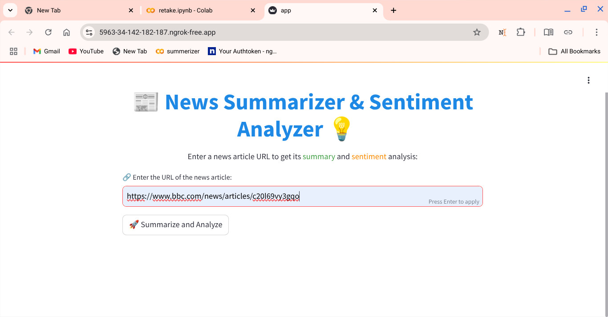
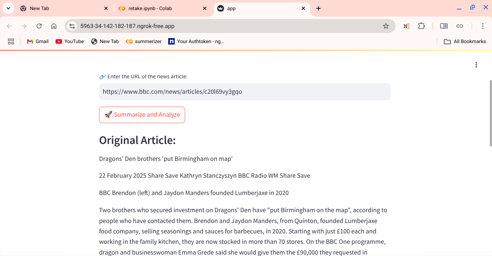
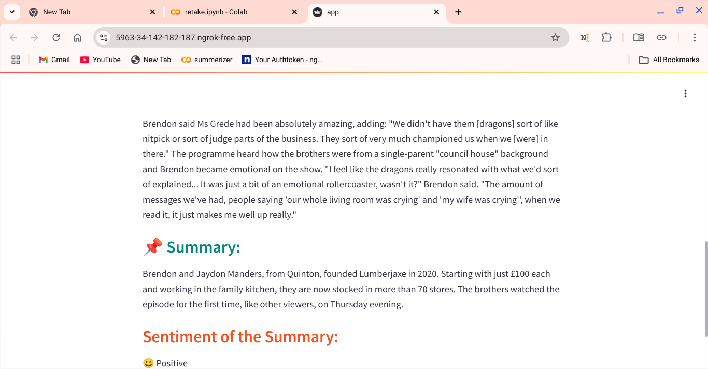

# 📰 News Summarizer & Sentiment Analyzer 💡

A **Streamlit web application** that extracts and summarizes news articles from a given URL and analyzes the sentiment of the summary (Positive, Negative, or Neutral).  
It's built using **NLP libraries** like `newspaper3k`, `Sumy`, and `TextBlob`.

---

## 🌐 Live Demo

🔗 [Check out the live app here!](https://news-summarizer-2-sg8rsnnccpwappn3czwwvxo.streamlit.app/))

---
## 🚀 Features

- 🔗 Extract news articles from any URL.
- ✂️ Summarize articles using the LSA algorithm.
- 🎭 Analyze sentiment (Positive, Neutral, Negative).
- 🎨 Stylish, colorful Streamlit interface.
- 📱 Fully responsive and easy to use.

---

## 📸 Demo Screenshot





---


## 🛠️ Tech Stack

- Python 3
- [Streamlit](https://streamlit.io/)
- [Newspaper3k](https://github.com/codelucas/newspaper)
- [Sumy](https://github.com/miso-belica/sumy)
- [TextBlob](https://textblob.readthedocs.io/en/dev/)

---

## 📦 Installation

1. **Clone the repository:**
   ```bash
   git clone https://github.com/your-username/news-summarizer-sentiment.git
   cd news-summarizer-sentiment
